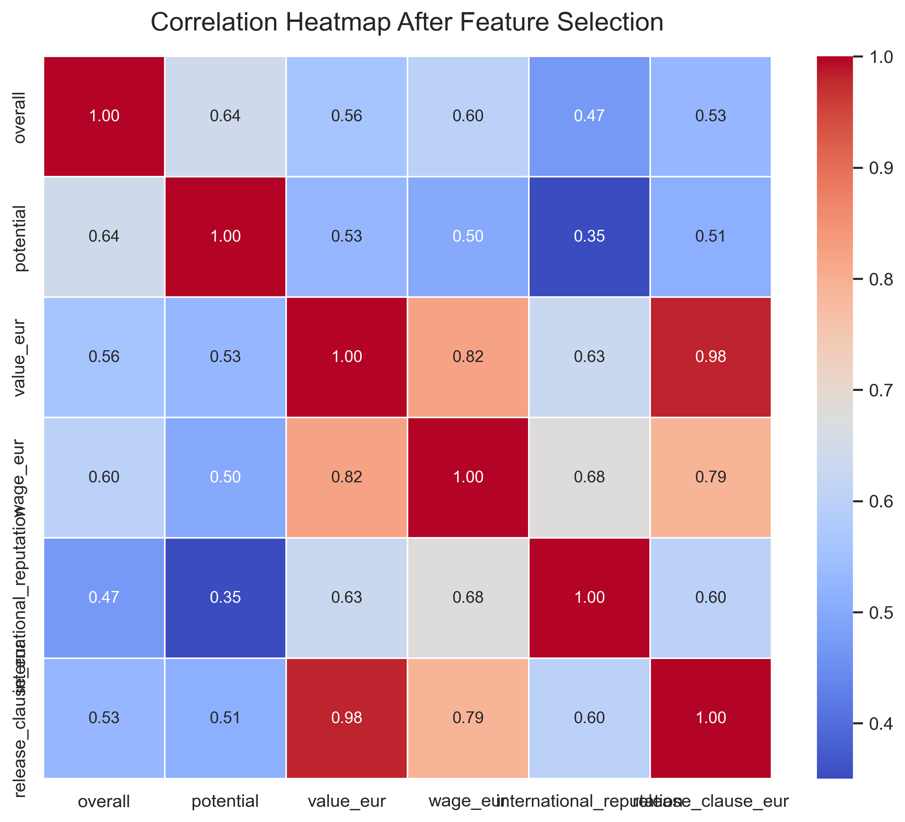
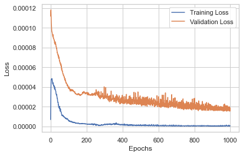

# Predicting Football Player Market Value

Regression on football (soccer) player attributes to predict market value in euros
(`value_eur`), comparing eight models — from linear regression to a PyTorch neural network —
selected on validation RMSE and confirmed with 5-fold cross-validation.

---

## Results

Validation RMSE (20% hold-out, `SEED = 1`), in euros:

| Model | Validation RMSE |
|---|---:|
| Lasso Regression (α = 0.1) | 7,476,516 |
| Elastic Net (α = 0.1) | 7,476,516 |
| Linear Regression | 1,537,864 |
| Ridge Regression (α = 0.1) | 1,536,609 |
| AdaBoost (depth-10 trees, 100 estimators) | 773,756 |
| Random Forest (350 trees) | 696,039 |
| Gradient Boosting (1,900 stages) | 680,035 |
| **Simple Neural Network** (2×256 hidden, Adam) | **558,401** |

The neural network wins, and 5-fold cross-validation confirms it is not a fluke of the split:

| Fold | 1 | 2 | 3 | 4 | 5 | **Average** |
|---|---:|---:|---:|---:|---:|---:|
| RMSE | 485,569 | 387,738 | 428,466 | 425,334 | 376,925 | **420,806** |

Cross-validated RMSE (420,806) comes out *better* than the single hold-out estimate
(558,401), because `KFold(shuffle=True)` mixes the data while the hold-out split used
`shuffle=False` and therefore inherited the dataset's original ordering.

Lasso and Elastic Net collapse to roughly predicting the mean. Their `α = 0.1` is applied to
a target scaled into `[0, 1]` by `MinMaxScaler`, which makes the penalty enormous relative
to the coefficients and shrinks them to nearly zero.

---

## Pipeline

| Step | Where |
|---|---|
| 1. Load the CSVs | `load_data` — `src/data.py` |
| 2. Drop uninformative columns (names, ids, dates, tags) | `features_pre_selection` — `src/data.py` |
| 3. Encode categoricals: target-encode `player_positions`, binarise national-team and loan status, one-hot `club_position`, turn contract expiry into a duration | `features_embedding` — `src/data.py` |
| 4. Check for residual NaNs | `data_evaluation` — `src/data.py` |
| 5. Feature selection in two passes: drop features correlating > 0.85 with each other, then those correlating < 0.50 with the target | `features_selection` — `src/features.py` |
| 6. Scale, train, compare, cross-validate, predict | `main.py` |

Step 5 reduces 58 columns to **five predictors**: `overall`, `potential`,
`international_reputation`, `wage_eur` and `release_clause_eur`.

Correlation structure before and after selection:

| Before (58 features) | After (6 columns) |
|---|---|
|  |  |

Neural-network training curve: 

---

## Repository structure

```text
main.py                      Full pipeline: load -> preprocess -> select -> train -> CV -> predict
config.py                    Paths and the random seed
src/
  data.py                    Loading and pre-processing
  features.py                Correlation analysis and feature selection
  model.py                   SimpleNeuralNetwork (PyTorch nn.Module with fit/predict)
ML_Project_notebook.ipynb    The original notebook, unchanged
data/                        train.csv, test.csv, submission.csv, column_descriptions.csv
img/                         Correlation heatmaps and the training curve
```

### Relationship between the notebook and the modules

`ML_Project_notebook.ipynb` is the original submission, kept byte-for-byte as handed in.
The Python modules are that notebook **split into a runnable project, with the code copied
verbatim**:

| Module | Notebook cells |
|---|---|
| `config.py` | 8 |
| `src/data.py` | 12, 14, 16, 18, 20 |
| `src/features.py` | 23, 26 |
| `src/model.py` | 31 |
| `main.py` | 36, 40, 43, 46 |

Function bodies were not rewritten, and `main.py` remains top-level script code in the same
order as the notebook, so the two are equivalent by construction: 653 lines copied across
the four files, each cell checked line for line against the notebook it came from.

The only additions are:

- import headers on each module;
- `matplotlib.use("Agg")` in `main.py`, because `heatmap_plot` calls `plt.show()`, which
  blocks when run as a script rather than in a notebook;
- `config.py` anchors its paths to `__file__` instead of `os.getcwd()`, so `main.py` works
  from any directory. This is the same pattern used in the original `ML Project - FINAL.py`.

---

## How to run

Requires **Python 3.10 or newer**.

```bash
pip install -r requirements.txt
python main.py
```

The run trains all eight models, cross-validates the winner and writes predictions to
`data/submission.csv`. Expect roughly 20–40 minutes on a laptop CPU: the neural network
trains for up to 1,000 epochs (early stopping with patience 150 usually fires around epoch
150), and it is retrained five more times during cross-validation.

The notebook is at the repository root rather than in a `notebooks/` folder on purpose: cell
8 resolves data as `./data`, relative to the working directory, so it needs to sit next to
`data/` to run unmodified.

---

## Data

`data/train.csv` (15,391 rows) and `data/test.csv` (3,848 rows) hold player attributes —
ratings, wages, contract details, position-specific skill scores. `test.csv` has no
`value_eur` column: the target was held back, as this was a prediction competition.
`data/column_descriptions.csv` documents every column.

The dataset derives from publicly available FIFA player data.

`data/submission.csv` is the predictions file submitted for the competition; re-running
`main.py` overwrites it.

---

## Known limitations

Two things a reader should know. Both are in the original submitted code and were left
as-is, because the point of this repository is to publish the project as it was, not a
revised version.

- **`release_clause_eur` correlates 0.976 with the target.** Release clauses are typically
  set as a direct multiple of a player's valuation, so the strongest predictor is close to
  a restatement of the answer. Keeping it is a deliberate choice in the code — it is
  explicitly exempted from the high-correlation drop list — and it explains much of the
  accuracy. A version excluding it would be a harder and arguably more interesting problem.
- **The test features are scaled with a scaler fitted on the 80% training split.**
  `X_test_scaled` is computed once, early in `main.py` (notebook cell 36). The final model
  is then retrained on 100% of the data with a freshly fitted scaler (cell 46), but the test
  matrix is not re-scaled to match. Since `MinMaxScaler` bounds barely move between 80% and
  100% of a 15k-row dataset the practical effect is small, but the two are not strictly
  consistent.

---

## Reproducibility check

Verified end to end on a clean virtual environment (Python 3.13, pandas 3.0.5,
scikit-learn 1.9.0, torch 2.14.0). `python main.py` runs from raw CSVs to a written
`submission.csv` and reproduces the project's decisions:

- feature selection returns the same five predictors;
- the same model wins the comparison (`SIMPLE NEURAL NETWORK`);
- 5-fold cross-validation confirms it, at an average RMSE of 420,806.

Compared against the predictions actually submitted for the competition, the regenerated
file correlates at **0.9995**, with a median relative difference of **2.25%** — close, but
not identical. Neural-network training is not bit-reproducible across PyTorch versions and
hardware even with `SEED = 1` and `cudnn.deterministic = True`, so exact agreement is not
expected. The RMSE figures in this README come from the verification run for the same
reason.

That the numbers move slightly while the structure holds is the expected outcome: the
guarantee that the refactor changed nothing is textual rather than statistical.

---

## License

[MIT](LICENSE) — covering the code. The dataset is not mine to license.
